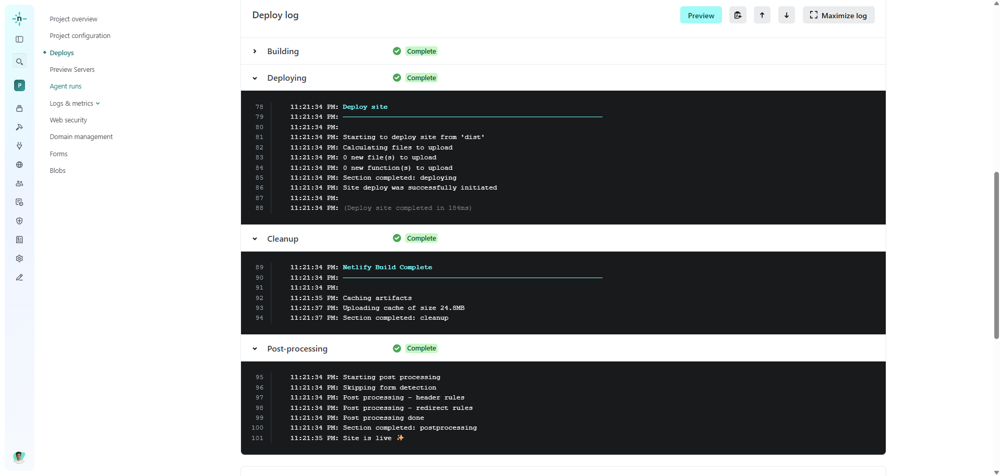
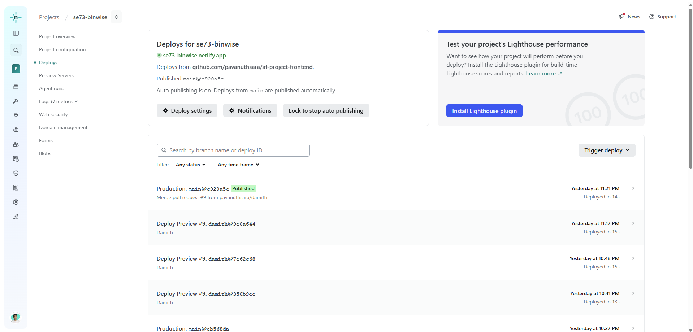
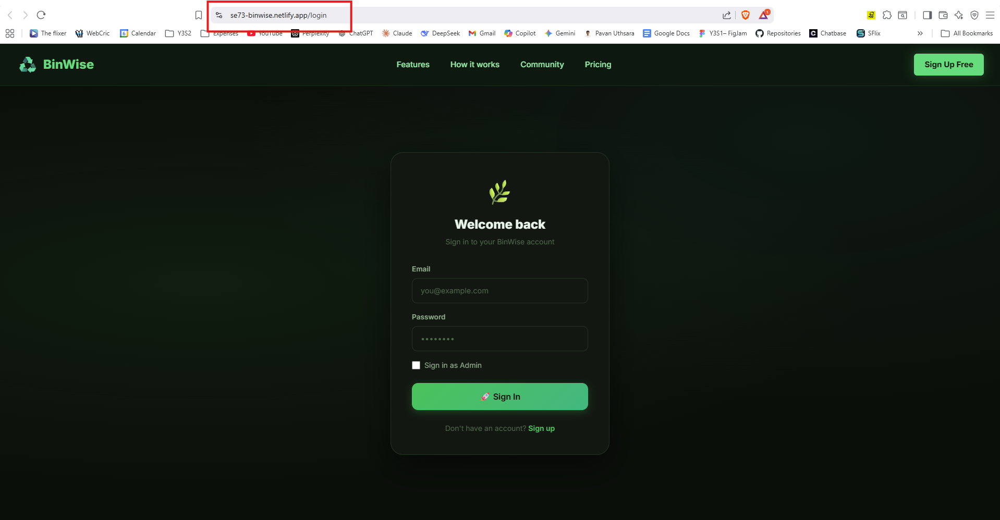
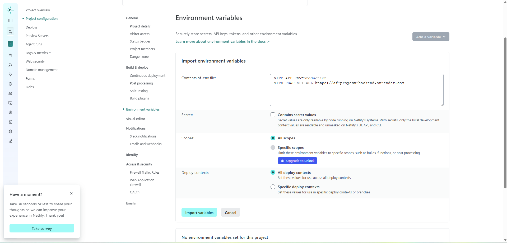
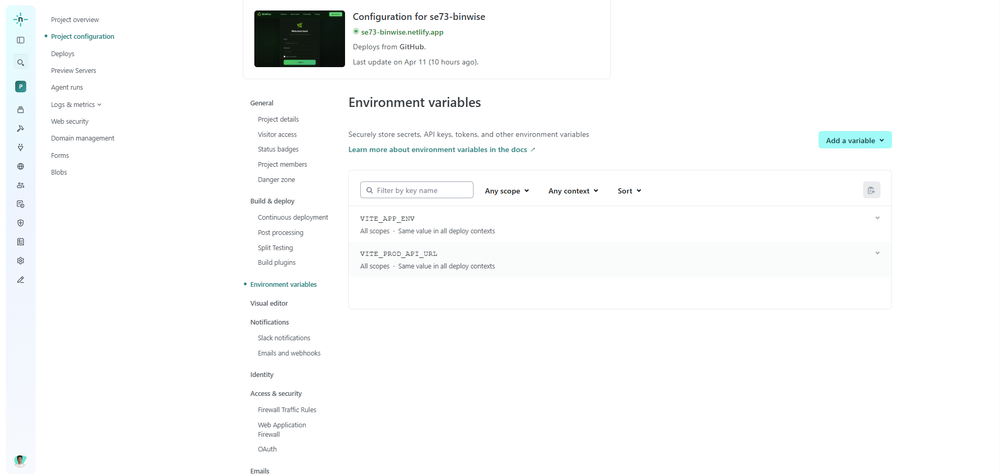

## Deployment Report

### Frontend (FE)

- URL: https://se73-binwise.netlify.app/login
- Platform: Netlify 

### How we deployed

1. Install dependencies and build:

```bash
pnpm install
pnpm build
```

2. Create a Netlify site and connect the repository.
3. Configure build settings:

	- Build command: `pnpm build`
	- Publish directory: `dist`

4. Trigger a deploy from the main branch; Netlify builds and publishes the site.

### Environment vaiables used

```bash
VITE_APP_ENV=production
VITE_PROD_API_URL=https://af-project-backend.onrender.com
```


### Screenshots of deployment









